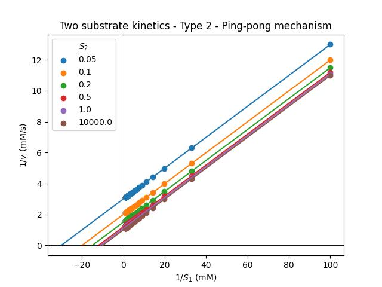
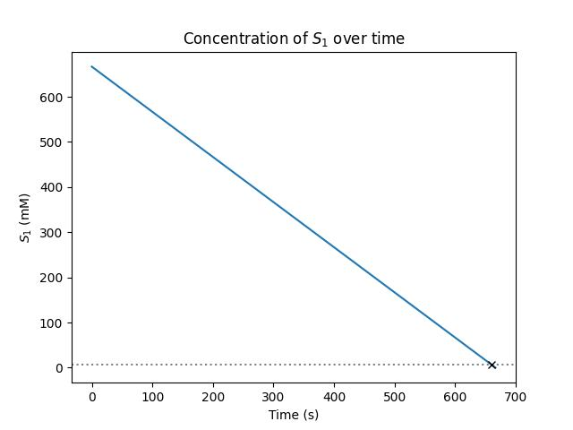

<!--- pandoc results.md -o results.pdf -V geometry:margin=1in --->

# Assignment 1: Results

## Question 1: The "Living" Ice

|$S_2$|$K_m/V_\text{max}$|$1/V\text{max}$|$-1/K_{m1}$|$R^2$|$V\text{max}$|$K_{m1}$|
|-----|-------------------|----------------|-----------|-----|--------------|-----|
|0.05|0.1000|3.0000|-30.0000|1.0000|0.3333|0.0333|
|0.1|0.1000|2.0000|-20.0000|1.0000|0.5000|0.0500|
|0.2|0.1000|1.5000|-15.0000|1.0000|0.6667|0.0667|
|0.5|0.1000|1.2000|-12.0000|1.0000|0.8333|0.0833|
|1.0|0.1000|1.1000|-11.0000|1.0000|0.9091|0.0909|
|10000.0|0.1000|1.0000|-10.0001|1.0000|1.0000|0.1000|

