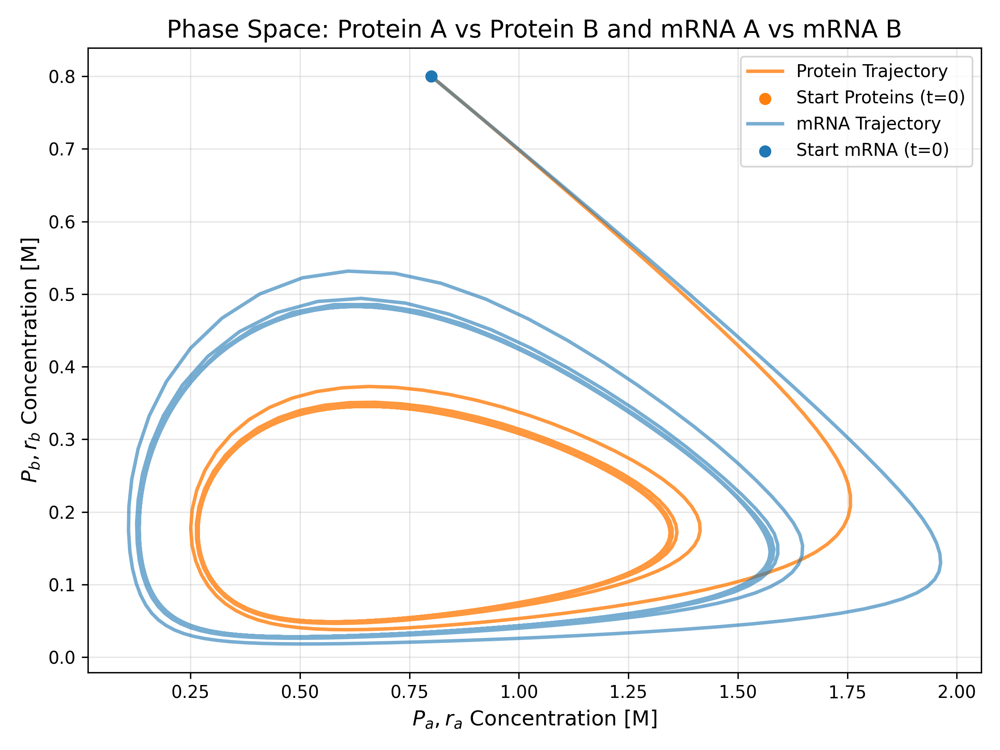
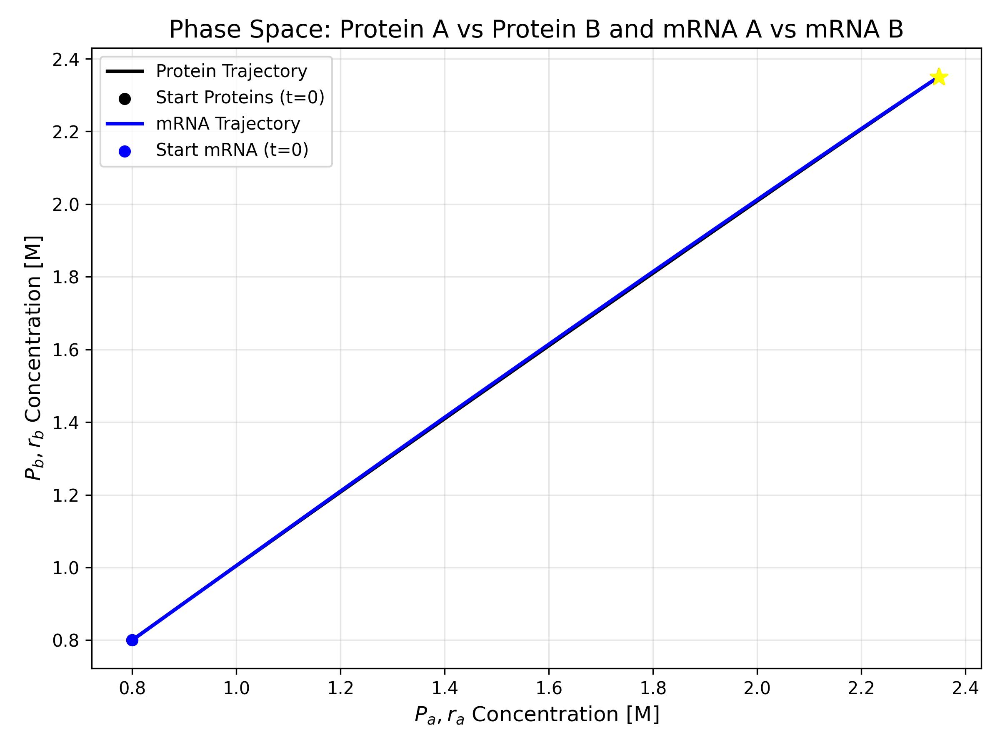
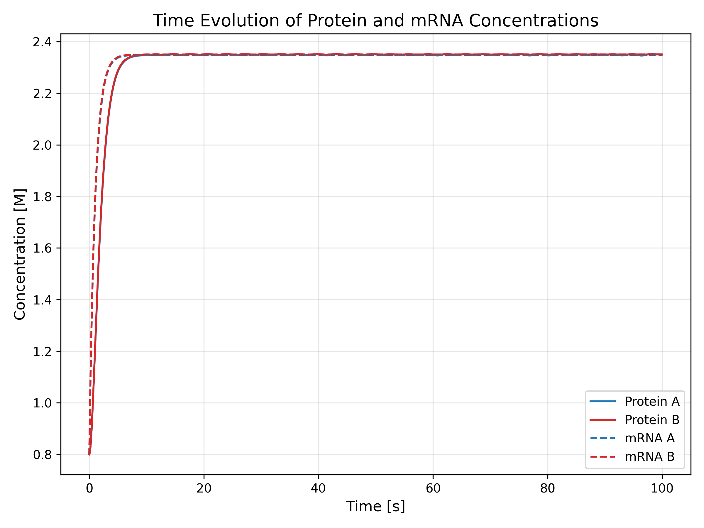
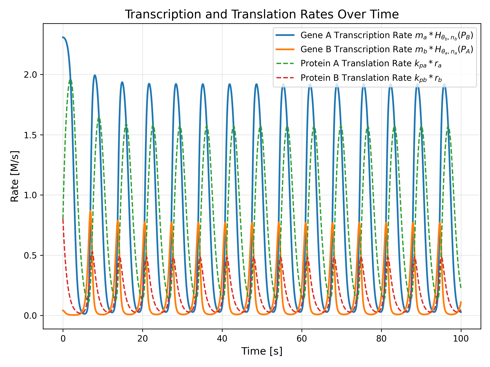
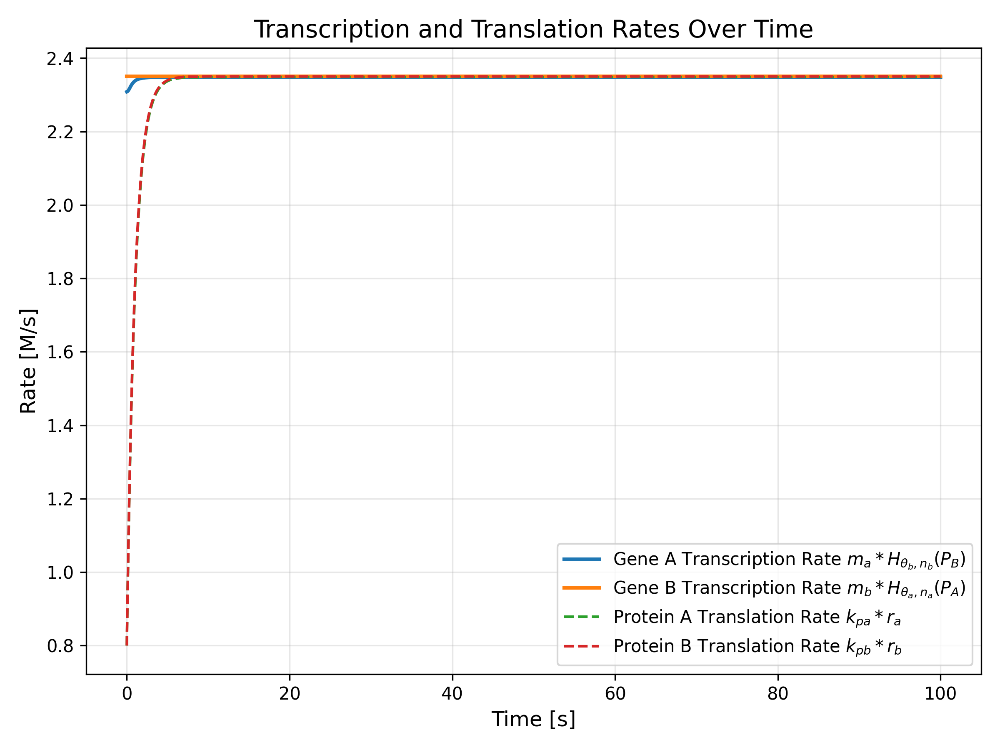
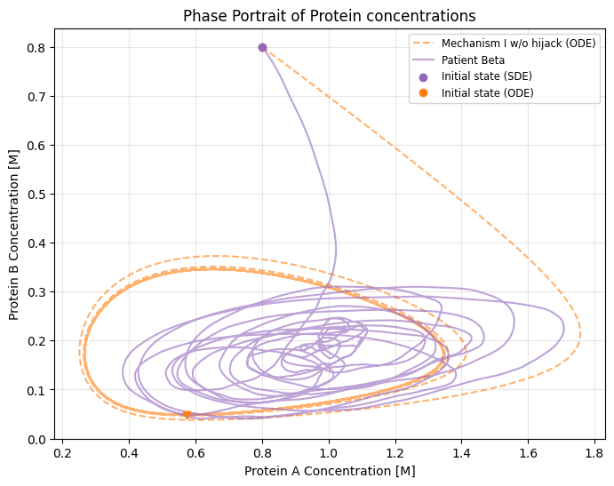
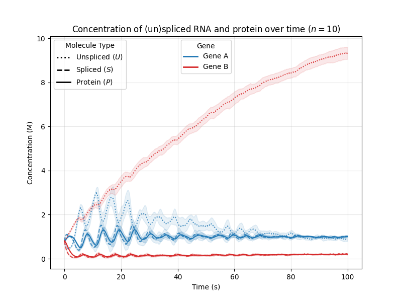
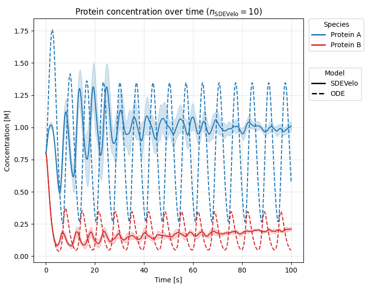

---
geometry:
- margin=1in
header-includes:
  - \usepackage{float}
  - \usepackage{subcaption}
---

# Assignment 2: Figures and tables

![Activation and Inhibition Hill Functions][plots/alpha_4_hill_functions.png]

| Healthy State | Hijacked State |
|:---:|:---:|
|  |  |
|  |  |
|  |  |

